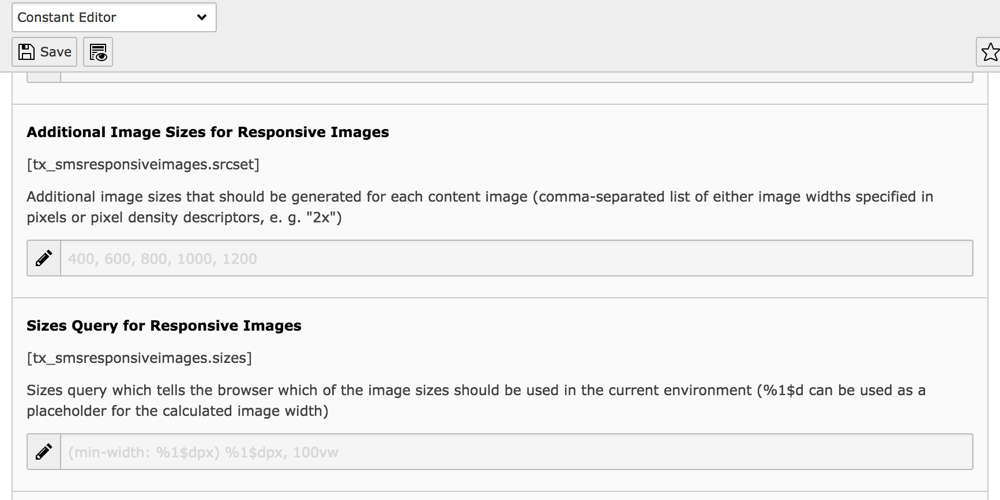

.. ==================================================
.. FOR YOUR INFORMATION
.. --------------------------------------------------
.. -*- coding: utf-8 -*- with BOM.

.. include:: ../Includes.txt

.. _installation:

Installation
====================

   New fields in constants editor

Composer mode
=============

If your TYPO3 installation uses Composer, install the latest Extension Builder
through:

.. code-block:: bash

   composer require sitegeist/sms-responsive-images

If you are not using the latest version of the Extension Builder, you need to
add a version constraint, for example:

.. code-block:: bash

   composer require sitegeist/sms-responsive-images:"^2.0.0"

Legacy mode
===========

If you are working with a TYPO3 installation that does not use Composer, install
the extension in the Extension Manager:

-  Navigate to :guilabel:`Admin Tools > Extensions > Get Extensions`.
-  Click on :guilabel:`Update now`
-  Search for `sms-responsive-images`
-  Click :guilabel:`Import and install` on the side of the extension entry

and activate it:

-  Navigate to :guilabel:`Admin Tools > Extensions > Installed Extensions`
-  Search for `sms-responsive-images`
-  Activate the extension by clicking on the :guilabel:`Activate` button in the
   :guilabel:`A/D` column

.. seealso::

   On pages ":doc:`Managing Extensions <t3start:Extensions/Management>`" and
   ":doc:`Managing Extensions - Legacy Guide <t3start:Extensions/LegacyManagement>`"
   both TYPO3 installation modes are explained in detail.

Updating from 1.x
-----------------

There are a few breaking changes which might require you to update your integration:

- Support for TYPO3 8.7 is gone. Please use version 1.3 of the extension.
- The ``picturefill`` attribute of ``<sms:image />`` and ``<sms:media />`` has been removed, so you need to remove it from your Fluid templates. Separate markup for picturefill.js is no longer required, so the extension now outputs standards-compliant markup at any time.
- In addition to svg files, gif files are now excluded as well. You can change this by adjusting the ``ignoreFileExtensions`` parameter.
- If ``lazyload`` is enabled, image tags will get a ``class="lazyload"`` automatically.

There are also some changes under the hood you might want to consider:

- The PHP namespace has switched from ``SMS\SmsResponsiveImages`` to ``Sitegeist\ResponsiveImages``, so if you extended one of the provided PHP classes, you need to adjust this.
- The extension now uses ``.1579774724`` instead of ``.100`` to overwrite the image partial of fluid_styled_content. This means that there will be less interference with other extensions. However, if you need to overwrite the ``Image.html`` file again, you need to specify your partial after that value.
- The demo plugin is gone, so if you were using it, it won't work anymore.
